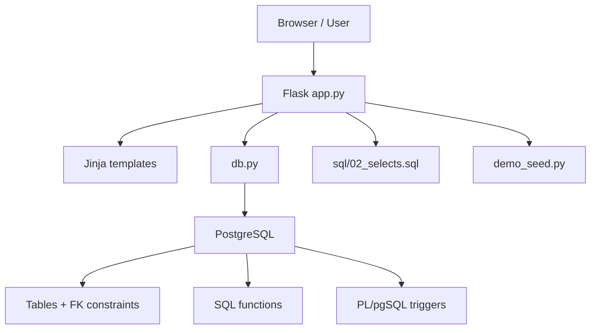
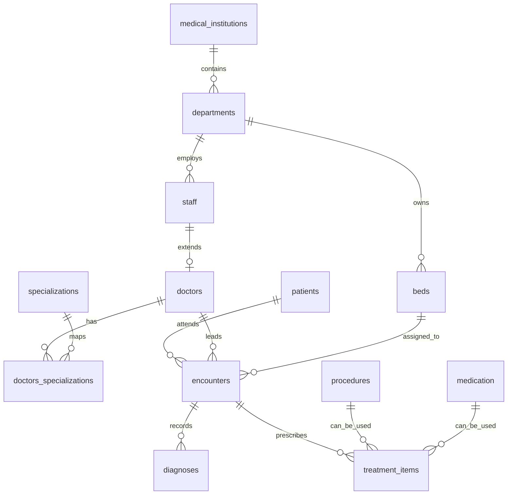

# HIV Clinic 🏥


**HIV Clinic** is a role-based medical information system demo for managing patients, encounters, diagnoses, procedures, medications, departments, staff, and treatment plans.

🇷🇺 **Русская версия** ниже.  
🇬🇧 **English version** starts [here](#english-version-).

> ⚕️ Проект предназначен для учебных, демонстрационных и прототипных сценариев. Не используйте реальные медицинские данные без полноценной авторизации, аудита, шифрования, юридической проверки и production-hardening.

---

## Русская Версия 🇷🇺

### Что Это Такое ✨

**HIV Clinic** — компактная, но насыщенная Flask + PostgreSQL система для клинического документооборота. В проекте есть полноценные роли, серверный UI, PostgreSQL-схема, справочники, демо-наполнение и бизнес-валидации на уровне приложения и базы.

Проект выглядит как учебный MVP медицинской MIS: быстрый запуск, понятная предметная модель, много реальных CRUD-сценариев и достаточно данных, чтобы интерфейс не был пустой витриной.

### Ключевые Возможности 🚀

- 🧑‍⚕️ **Роль врача**: список своих пациентов, карточка пациента, создание и редактирование приема, добавление диагнозов и назначений.
- 🧑 **Роль пациента**: просмотр приемов, диагнозов и назначений, фильтр активных назначений.
- 🛠️ **Роль администратора**: dashboard и CRUD для сотрудников, учреждений, отделений, пациентов, препаратов, процедур и специализаций.
- 🔎 **Умный поиск**: фильтрация по ФИО, телефону, email, СНИЛС, паспорту, полу, датам, типам приемов и справочникам.
- 🛏️ **Койки и госпитализации**: свободные койки выбираются только для inpatient-приемов.
- 💊 **Назначения**: процедура или медикамент, но строго один вариант на запись.
- 🧬 **PostgreSQL-first логика**: внешние ключи, SQL-функция `get_doctor_patients`, PL/pgSQL-триггер для XOR-правила назначений.
- 🌱 **Демо-данные**: автоматическая генерация большого набора данных при старте приложения.
- 🎨 **Server-rendered UI**: Jinja-шаблоны, адаптивная верстка, inline CSS и небольшие JS-помощники для форм.

### Технологический Стек 🧰

| Слой | Технологии |
| --- | --- |
| Backend | Python, Flask |
| Database | PostgreSQL, PL/pgSQL |
| DB Driver | psycopg2, RealDictCursor |
| Frontend | Jinja2, HTML, CSS, vanilla JS |
| Seed/Data | SQL seed + deterministic Python demo generator |

### Архитектура 🧭



При старте приложение:

1. Создает или обновляет таблицы из `sql/00_create.sql`.
2. Поднимает SQL-функции из `sql/03_procedures.sql`.
3. Поднимает триггеры из `sql/04_triggers.sql`.
4. Загружает базовый seed из `sql/01_seed.sql`, если БД пустая.
5. Дозаполняет демо-данные через `demo_seed.py`.
6. Загружает именованные SELECT-запросы из `sql/02_selects.sql`.

### Модель Данных 🗄️



### Структура Репозитория 📁

```text
.
├── app.py                    # Flask-приложение, маршруты, роли, формы, валидация
├── config.py                 # Настройки подключения к PostgreSQL через ENV
├── db.py                     # Тонкий слой для query/execute/execute_many/scripts
├── demo_seed.py              # Большой детерминированный demo dataset
├── requirements.txt          # Python-зависимости
├── sql/
│   ├── 00_create.sql         # Таблицы и связи
│   ├── 01_seed.sql           # Базовый seed
│   ├── 02_selects.sql        # Именованные SELECT-запросы
│   ├── 03_procedures.sql     # SQL-функции
│   └── 04_triggers.sql       # PL/pgSQL-триггеры
└── templates/                # Jinja UI для admin / doctor / patient
```

### Быстрый Старт ⚡

#### 1. Подготовьте окружение

```bash
python -m venv .venv
source .venv/bin/activate
pip install -r requirements.txt
```

#### 2. Создайте PostgreSQL-базу

```bash
createdb hiv_project_test
```

По умолчанию приложение использует:

```bash
DB_HOST=localhost
DB_PORT=5432
DB_NAME=hiv_project_test
DB_USER=<ваш системный пользователь>
DB_PASSWORD=
APP_PORT=5050
```

Если настройки отличаются:

```bash
export DB_HOST=localhost
export DB_PORT=5432
export DB_NAME=hiv_project_test
export DB_USER=postgres
export DB_PASSWORD=your_password
export FLASK_SECRET=change-me
export APP_PORT=5050
```

#### 3. Запустите приложение

```bash
python app.py
```

Откройте:

```text
http://localhost:5050
```

### Демо-Доступ 🔐

| Роль | Как войти |
| --- | --- |
| Администратор | роль `admin`, логин `admin`, пароль `admin` |
| Врач | роль `doctor`, ID существующего врача, например `1` |
| Пациент | роль `patient`, ID существующего пациента, например `1` |

> 🔒 `admin/admin` — только для локальной демонстрации. Для production это должно быть вынесено в ENV, захешировано и закрыто нормальной auth-системой.

### Демо-Данные 🌱

`demo_seed.py` автоматически стремится наполнить базу до:

- 300 сотрудников
- 96 врачей
- 300 коек
- 300 пациентов
- 360 приемов
- 360 диагнозов
- 360 назначений

Генерация детерминированная: данные выглядят живыми, но воспроизводимыми. Это удобно для проверки поиска, карточек, назначений и больших таблиц.

### Основные Сценарии 🧪

**Админ**

- Открыть `/admin`.
- Проверить счетчики сущностей.
- Создать или отредактировать учреждение, отделение, сотрудника, пациента, препарат, процедуру или специализацию.
- Использовать поиск и фокусировку на созданной записи.

**Врач**

- Войти как `doctor` с ID `1`.
- Открыть список своих пациентов.
- Найти пациента по ФИО, паспорту, СНИЛС, полу или дате рождения.
- Создать прием, выбрать тип и при необходимости свободную койку.
- Добавить диагнозы и назначения в рамках одного приема.

**Пациент**

- Войти как `patient` с ID `1`.
- Посмотреть приемы, диагнозы и назначения.
- Включить фильтр только активных назначений.

### Инженерные Детали 🧠

- `db.py` открывает короткое соединение на каждый запрос и возвращает словари через `RealDictCursor`.
- `sql/02_selects.sql` хранит именованные SQL-запросы в формате `SELECT 'QUERY_NAME'; SELECT ...`.
- `app.py` загружает эти запросы в словарь `SELECTS`, чтобы держать крупные выборки вне Python-кода.
- `validate_treatment_item_xor` на уровне PostgreSQL запрещает назначение, где одновременно выбраны и процедура, и лекарство, либо не выбрано ничего.
- Проверки доступа разделены по ролям: `require_admin`, `require_doctor`, `require_patient`.
- Доктор видит только пациентов, с которыми у него есть приемы.

### Переменные Окружения ⚙️

| Переменная | Значение по умолчанию | Назначение |
| --- | --- | --- |
| `DB_HOST` | `localhost` | Хост PostgreSQL |
| `DB_PORT` | `5432` | Порт PostgreSQL |
| `DB_NAME` | `hiv_project_test` | Имя базы |
| `DB_USER` | системный пользователь | Пользователь БД |
| `DB_PASSWORD` | пустая строка | Пароль БД |
| `FLASK_SECRET` | `local-secret-key` | Flask secret key |
| `APP_PORT` | `5050` | Порт приложения |

### Сброс Локальной Базы 🧹

Осторожно: команда удалит локальную базу.

```bash
dropdb hiv_project_test
createdb hiv_project_test
python app.py
```

### Что Улучшить Перед Production 🧱

- 🔐 Нормальная аутентификация: хеши паролей, роли в БД, сессии, logout hardening.
- 🧾 Аудит действий: кто смотрел и менял медицинские данные.
- 🛡️ CSRF-защита для POST-форм.
- 🔄 Миграции через Alembic вместо прямого DDL на старте.
- 🧵 Connection pooling для PostgreSQL.
- 🧪 Тесты: unit для валидаторов, integration для маршрутов, SQL regression tests.
- 📦 Docker Compose для повторяемого запуска.
- 🔍 Логирование и error handling для production.

### Troubleshooting 🩺

| Симптом | Что проверить |
| --- | --- |
| `OperationalError` от psycopg2 | PostgreSQL запущен, ENV-переменные корректны, база создана |
| `permission denied for database` | У пользователя БД есть права на создание таблиц/функций/триггеров |
| Не получается выбрать койку | Для госпитализации подходят только свободные койки |
| Пустой список пациентов у врача | Врач видит только пациентов из своих приемов |
| Ошибка входа пациента/врача | Используйте существующий ID из seed/demo данных |

---

## English Version 🇬🇧

### What Is This ✨

**HIV Clinic** is a compact but feature-rich Flask + PostgreSQL medical information system demo. It includes role-based workflows, a server-rendered UI, a relational schema, reference catalogs, generated demo data, and business validation both in Python and PostgreSQL.

Think of it as a clean MVP-style clinical MIS prototype: simple to run, easy to inspect, and packed with enough real behavior to be useful for coursework, demos, and further product experiments.

### Features 🚀

- 🧑‍⚕️ **Doctor workspace**: assigned patients, patient chart, encounter creation/editing, diagnoses, procedures, medications, and treatment plans.
- 🧑 **Patient portal**: encounters, diagnoses, treatments, and active-treatment filtering.
- 🛠️ **Admin console**: dashboard and CRUD for staff, institutions, departments, patients, medications, procedures, and specializations.
- 🔎 **Search-first UX**: validated filters across names, phones, emails, SNILS/passport fields, sex, dates, encounter types, and catalogs.
- 🛏️ **Bed-aware encounters**: inpatient encounters require an available bed.
- 💊 **Treatment integrity**: each treatment item must reference exactly one procedure or medication.
- 🧬 **PostgreSQL-backed domain rules**: foreign keys, SQL functions, and a PL/pgSQL trigger.
- 🌱 **Rich demo seed**: deterministic generated data so the app feels populated immediately.
- 🎨 **Server-rendered interface**: Jinja templates, responsive CSS, and small vanilla JS helpers.

### Tech Stack 🧰

| Layer | Technologies |
| --- | --- |
| Backend | Python, Flask |
| Database | PostgreSQL, PL/pgSQL |
| DB Driver | psycopg2, RealDictCursor |
| Frontend | Jinja2, HTML, CSS, vanilla JS |
| Seed/Data | SQL seed + deterministic Python demo generator |

### Architecture 🧭


On startup, the app:

1. Creates or updates tables from `sql/00_create.sql`.
2. Installs SQL functions from `sql/03_procedures.sql`.
3. Installs triggers from `sql/04_triggers.sql`.
4. Loads the base seed from `sql/01_seed.sql` if the database is empty.
5. Extends the dataset with `demo_seed.py`.
6. Loads named SELECT queries from `sql/02_selects.sql`.

### Data Model 🗄️


### Repository Map 📁

```text
.
├── app.py                    # Flask app, routes, roles, forms, validation
├── config.py                 # PostgreSQL settings via ENV
├── db.py                     # Thin query/execute/execute_many/script helper layer
├── demo_seed.py              # Large deterministic demo dataset
├── requirements.txt          # Python dependencies
├── sql/
│   ├── 00_create.sql         # Tables and relationships
│   ├── 01_seed.sql           # Base seed
│   ├── 02_selects.sql        # Named SELECT queries
│   ├── 03_procedures.sql     # SQL functions
│   └── 04_triggers.sql       # PL/pgSQL triggers
└── templates/                # Jinja UI for admin / doctor / patient
```

### Quick Start ⚡

#### 1. Prepare Python

```bash
python -m venv .venv
source .venv/bin/activate
pip install -r requirements.txt
```

#### 2. Create the PostgreSQL database

```bash
createdb hiv_project_test
```

Default configuration:

```bash
DB_HOST=localhost
DB_PORT=5432
DB_NAME=hiv_project_test
DB_USER=<your system user>
DB_PASSWORD=
APP_PORT=5050
```

Override when needed:

```bash
export DB_HOST=localhost
export DB_PORT=5432
export DB_NAME=hiv_project_test
export DB_USER=postgres
export DB_PASSWORD=your_password
export FLASK_SECRET=change-me
export APP_PORT=5050
```

#### 3. Run the app

```bash
python app.py
```

Open:

```text
http://localhost:5050
```

### Demo Login 🔐

| Role | Login method |
| --- | --- |
| Admin | role `admin`, login `admin`, password `admin` |
| Doctor | role `doctor`, existing doctor ID, for example `1` |
| Patient | role `patient`, existing patient ID, for example `1` |

> 🔒 `admin/admin` is local-demo-only. For production, move credentials to a proper authentication system with password hashing and policy controls.

### Demo Dataset 🌱

`demo_seed.py` automatically grows the local database up to:

- 300 staff members
- 96 doctors
- 300 beds
- 300 patients
- 360 encounters
- 360 diagnoses
- 360 treatment items

The generator is deterministic, which makes the dataset lively but reproducible.

### Main Workflows 🧪

**Admin**

- Open `/admin`.
- Inspect entity counters.
- Create or edit institutions, departments, staff, patients, medications, procedures, and specializations.
- Use search and focused redirects after creating records.

**Doctor**

- Log in as `doctor` with ID `1`.
- Open assigned patients.
- Search by name, passport, SNILS, sex, or birth date.
- Create an encounter and select a bed when the encounter is inpatient.
- Add diagnoses and treatment items within a single encounter.

**Patient**

- Log in as `patient` with ID `1`.
- Review encounters, diagnoses, and treatments.
- Toggle active treatments only.

### Engineering Notes 🧠

- `db.py` uses short-lived PostgreSQL connections and returns dictionaries through `RealDictCursor`.
- `sql/02_selects.sql` stores named SQL queries using the `SELECT 'QUERY_NAME'; SELECT ...` pattern.
- `app.py` loads these queries into `SELECTS`, keeping larger SQL reads outside Python route bodies.
- `validate_treatment_item_xor` enforces the procedure-or-medication rule inside PostgreSQL.
- Access checks are split into `require_admin`, `require_doctor`, and `require_patient`.
- Doctors can only view patients connected to their own encounters.

### Environment Variables ⚙️

| Variable | Default | Purpose |
| --- | --- | --- |
| `DB_HOST` | `localhost` | PostgreSQL host |
| `DB_PORT` | `5432` | PostgreSQL port |
| `DB_NAME` | `hiv_project_test` | Database name |
| `DB_USER` | system user | Database user |
| `DB_PASSWORD` | empty string | Database password |
| `FLASK_SECRET` | `local-secret-key` | Flask secret key |
| `APP_PORT` | `5050` | Application port |

### Reset Local Database 🧹

Careful: this deletes the local database.

```bash
dropdb hiv_project_test
createdb hiv_project_test
python app.py
```

### Production Readiness Checklist 🧱

- 🔐 Real authentication: hashed passwords, DB-backed roles, hardened sessions.
- 🧾 Audit logging for reads and writes of medical data.
- 🛡️ CSRF protection for POST forms.
- 🔄 Alembic migrations instead of startup DDL.
- 🧵 PostgreSQL connection pooling.
- 🧪 Tests: validators, routes, integration flows, and SQL regression checks.
- 📦 Docker Compose for reproducible local environments.
- 🔍 Production logging and error handling.

### Troubleshooting 🩺

| Symptom | Check |
| --- | --- |
| psycopg2 `OperationalError` | PostgreSQL is running, ENV values are correct, database exists |
| `permission denied for database` | DB user can create tables, functions, and triggers |
| Cannot select a bed | Inpatient encounters require an available bed |
| Doctor sees no patients | Doctors only see patients from their own encounters |
| Doctor/patient login fails | Use an existing seeded/demo ID |

---

Built with Flask, PostgreSQL, and a lot of respect for clean clinical workflows. 🫀
